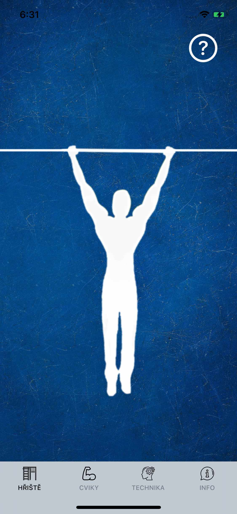
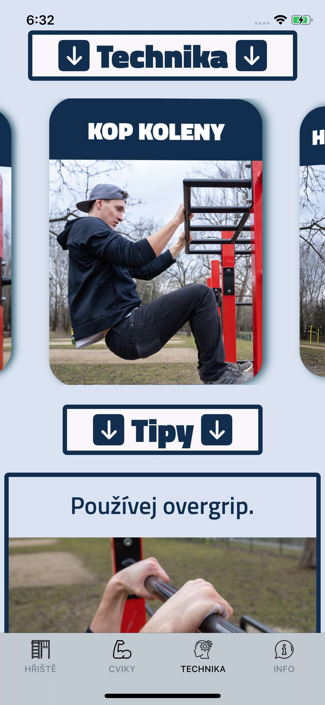

# MuscleUpApp

Pro všechny nadšence pohybu co se chtějí dostat nad hrazdu. :)

V rámci zobrazení gifu je potřeba SDWebImageSwiftUI image loading framework.

Pod file je přiložený ve složce aplikace, pokud máte nainstalovaný CocoaPods manager -> ( $ sudo gem install cocoapods ).

V tom případě by mělo stačit skrz terminál v dáné složce napsat -> ( pod install )

